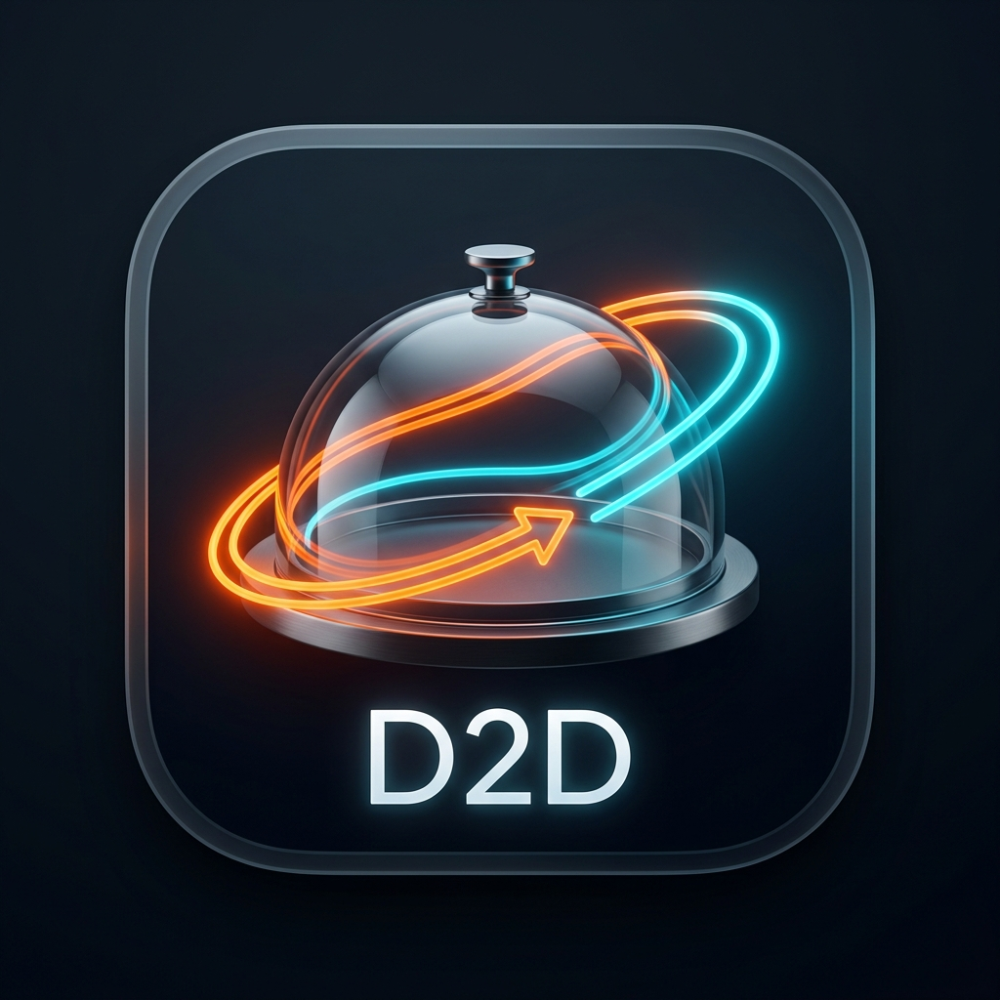
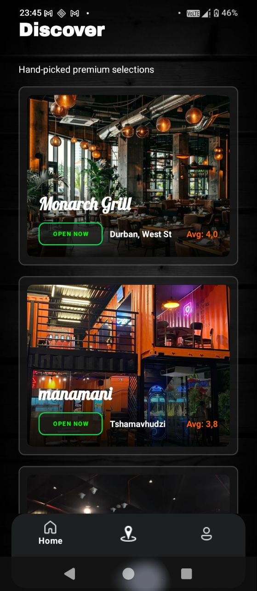
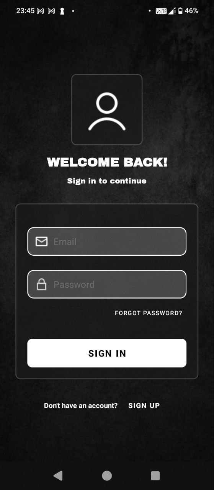
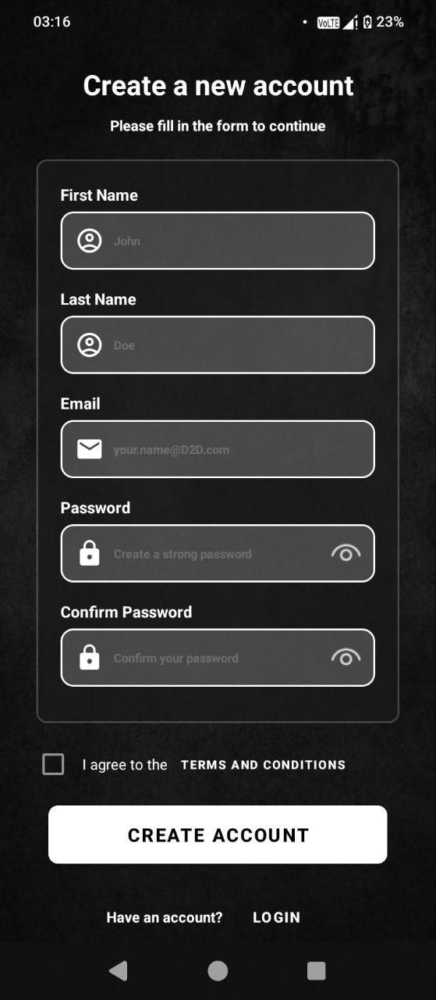

<div align="center">

<picture>
  
</picture>

# Dream To Digital (D2D)
**Enterprise Order Tracking & Fulfillment Monitoring System**

[](https://android.com)
[](https://android-arsenal.com/api?level=25)
[](https://www.java.com/)
[](https://www.postgresql.org/)
[](https://www.php.net/)
[](LICENSE)


### [ Download App](https://github.com/limuwani/D2D_group_project/releases/latest) • [ Report Bug](https://github.com/limuwani/D2D_group_project/issues) • [ Request Feature](https://github.com/limuwani/D2D_group_project/issues)

</div>

---

##  Overview

**Dream To Digital (D2D)** is a comprehensive, scalable Android application tailored to streamline order tracking, fulfillment monitoring, and service feedback collection for the food and beverage industry. Rather than a customer-facing e-commerce application, D2D serves as a robust internal and customer operational tool ensuring transparency throughout the order lifecycle—from preparation to collection.

With distinct portals for both **Customers** and **Staff Members**, D2D provides targeted features that reduce bottlenecks, enhance operational efficiency, and deliver actionable insights through structured user feedback.

---

##  Key Features

###  Customer Portal
- **Real-Time Order Tracking:** Seamlessly monitor active order status transitions (`PENDING` -> `READY` -> `COLLECTED`).
- **Order History:** Access a comprehensive log of past orders and transactions.
- **Service Rating & Feedback:** Rate specific service instances and leave detailed feedback to improve overall fulfillment quality.
- **Restaurant Discovery:** Browse through a curated list of partnered restaurants and explore their offerings.
- **Secure Authentication:** Robust sign-up/login processes with password recovery, fortified by custom security questions.

###  Staff Fulfillment Portal
- **Queue Management:** Dedicated interface for authorized personnel to view incoming orders.
- **Order Assignment & Fulfillment:** Assign specific orders, mark them as ready, and confirm final takeaways.
- **Feedback Analysis:** Review customer satisfaction metrics to maintain high service standards.

---

##  Visual Interface

<div align="center">
<table>
  <tr>
    <td align="center" width="25%">
      
      <br/><b> Discover</b>
    </td>
    <td align="center" width="25%">
      
      <br/><b> Initialize Order</b>
    </td>
    <td align="center" width="25%">
      
      <br/><b> Manage Order</b>
    </td>
    <td align="center" width="25%">
      
      <br/><b> Staff Portal</b>
    </td>
  </tr>
  <tr>
    <td align="center">
      
      <br/><b> Login</b>
    </td>
    <td align="center">
      
      <br/><b> Registration</b>
    </td>
    <td align="center">
      
      <br/><b> Empty State</b>
    </td>
    <td align="center">
      
      <br/><b> About D2D</b>
    </td>
  </tr>
</table>
</div>

---

##  Technology Stack & Architecture

D2D is engineered following modern Android development practices to ensure performance, maintainability, and scalability.

### Mobile Frontend (Android)
- **Languages:** Java / Kotlin
- **Minimum SDK:** 25 (Android 7.1)
- **Target SDK:** 35 (Android 15)
- **UI Toolkit:** XML Layouts, Material Design Components, ConstraintLayout
- **Architecture Components:** ViewModel, LiveData, Android Navigation Component
- **Networking:** OkHttp3 for HTTP communication with PHP scripts, Gson for JSON serialization/deserialization

### Backend Services & Database
- **API Layer:** PHP scripts processing HTTP requests securely.
- **Database:** PostgreSQL for robust, transactional data integrity.

---

##  Getting Started

### Prerequisites
- Android Studio Ladybug (or newer recommended)
- Java Development Kit (JDK) 17+
- An active internet connection for API interactions

### Local Installation
1. **Clone the repository:**
   ```bash
   git clone https://github.com/limuwani/D2D_group_project.git
   ```
2. **Open the project:**
   Launch Android Studio and select `Open an Existing Project`. Navigate to the cloned directory.
3. **Sync Gradle:**
   Allow Android Studio to sync the project dependencies via `build.gradle.kts`.
4. **Run the application:**
   Connect a physical device or start an emulator running API 25+, and click the `Run` button.

---

##  Downloads

Ready-to-install Android Application Packages (APK) are distributed through GitHub Releases.

<div align="center">

| Source | Badge | Details |
| :--- | :---: | :--- |
| **Latest Release** | [](https://github.com/limuwani/D2D_group_project/releases/latest) | Direct, compiled `.apk` binary |

</div>

---

##  Contributing

Contributions are what make the open-source community such an amazing place to learn, inspire, and create. Any contributions you make are **greatly appreciated**.

1. Fork the Project
2. Create your Feature Branch (`git checkout -b feature/AmazingFeature`)
3. Commit your Changes (`git commit -m 'Add some AmazingFeature'`)
4. Push to the Branch (`git push origin feature/AmazingFeature`)
5. Open a Pull Request

---

##  Development Team

The success of D2D is driven by:
* [**sphe-hlongwa**](https://github.com/sphe-hlongwa)
* [**limuwani**](https://github.com/limuwani)
* [**nthabi2906**](https://github.com/nthabi2906)

---

<div align="center">

###  Enhancing operational efficiency, one order at a time.

<sub>**License:** Distributed under the [ISC License](LICENSE). See `LICENSE` for more information.</sub><br>
<sub>© 2026 D2D. All rights reserved.</sub><br>
<sub> If D2D helped streamline your processes, please consider giving it a star! </sub>

</div>
