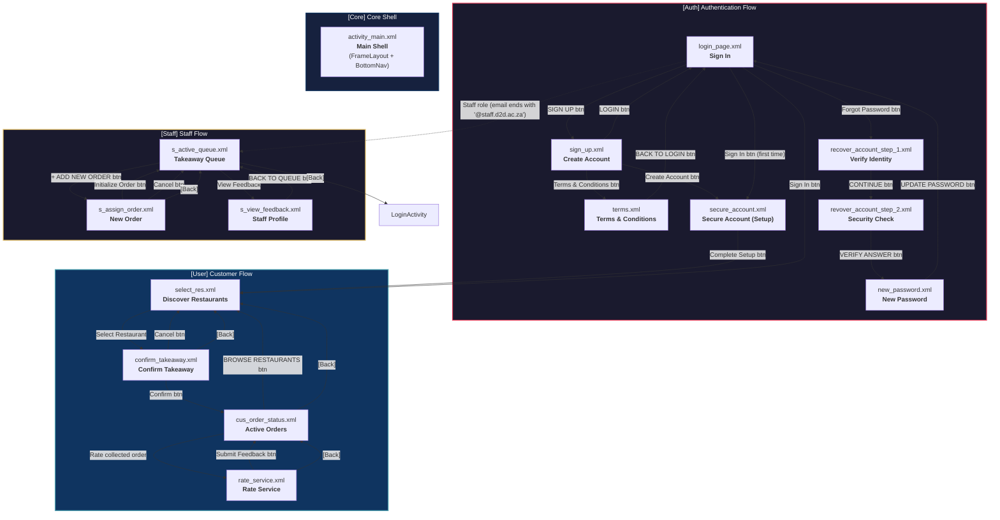
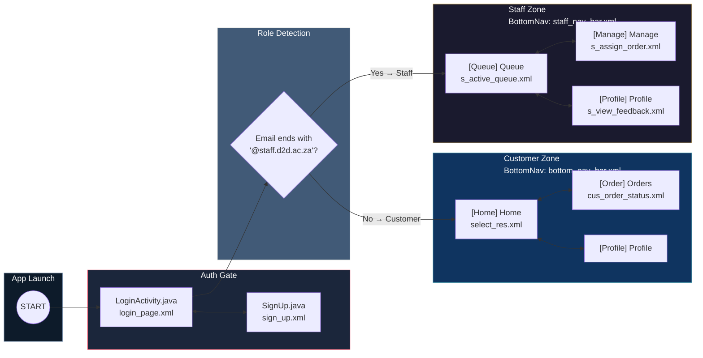
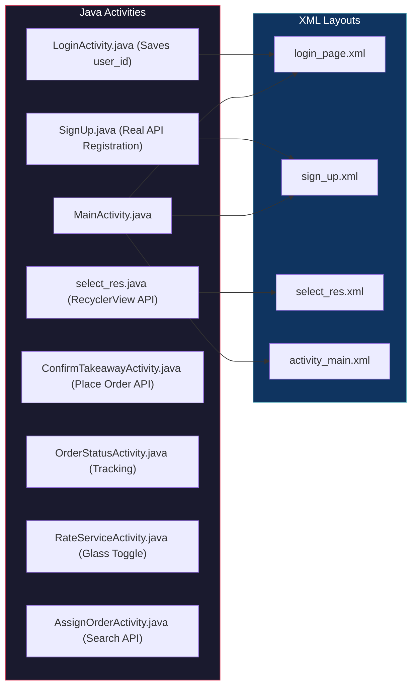
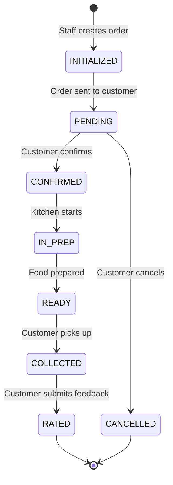

# D2D Ordering System — Design Layout & Navigation Specification

> **Project**: D2D Group Project  
> **Package**: `com.example.d2d`  
> **Document Version**: 1.2  
> **Last Updated**: May 11, 2026 (Production API & Dynamic UI Integration)  
> **Live Mockup**: [d2ddesignmock.netlify.app](https://d2ddesignmock.netlify.app)

---

## 1. Screen Inventory

The application consists of **16 XML layout files** organized across three functional domains:

| # | Layout File | Screen Title | Domain | Role Access |
|---|-------------|-------------|--------|-------------|
| 1 | `login_page.xml` | Sign In | Authentication | All Users |
| 2 | `sign_up.xml` | Create Account | Authentication | Customer |
| 3 | `secure_account.xml` | Secure Your Account | Authentication | Customer |
| 4 | `recover_account_step_1.xml` | Reset Password (ID) | Authentication | Customer |
| 5 | `revover_account_step_2.xml` | Security Check | Authentication | Customer |
| 6 | `new_password.xml` | Reset Password | Authentication | Customer |
| 7 | `terms.xml` | Terms & Conditions | Authentication | All Users |
| 8 | `activity_main.xml` | Main Shell (Nav Host) | Core Framework | All Users |
| 9 | `select_res.xml` | Discover Restaurants | Customer | Customer |
| 10 | `confirm_takeaway.xml` | Confirm Takeaway | Customer | Customer |
| 11 | `cus_order_status.xml` | Active Orders | Customer | Customer |
| 12 | `rate_service.xml` | Rate Service | Customer | Customer |
| 13 | `s_assign_order.xml` | New Order | Staff | Staff / Waiter |
| 14 | `s_active_queue.xml` | Takeaway Queue | Staff | Staff / Waiter |
| 15 | `s_view_feedback.xml` | Staff Profile / Feedback | Staff | Staff / Waiter |
| 16 | `item_restaurant.xml` | Restaurant Card (Reusable) | Component | Customer |

---

## 2. Complete Navigation Flow Graph

---

## 3. Role-Based Access Architecture

---

## 4. Bottom Navigation Bar Structure

### 4.1 Customer Navigation (`bottom_nav_bar.xml`)

| Tab | ID | Icon | Destination |
|-----|----|------|-------------|
| Home | `home_button` | `home_icon` | `select_res.xml` |
| Orders | `orders` | `track_order` | `cus_order_status.xml` |
| Profile | `profile` | `profile_icon` | User profile screen |

### 4.2 Staff Navigation (`staff_nav_bar.xml`)

| Tab | ID | Icon | Destination |
|-----|----|------|-------------|
| Queue | `staff_home_button` | `home_icon` | `s_active_queue.xml` |
| New Order | `manage` | `manage_icon` | `s_assign_order.xml` |
| Profile | `staff_profile` | `profile_icon` | `s_view_feedback.xml` |

> [!NOTE]
> `activity_main.xml` hosts both navigation bars (`bottom_navigation` and `bottom_navigation_staff`), toggling visibility based on the authenticated user's role. A shared `FrameLayout` (`content_frame`) serves as the fragment container.

---

## 5. Screen-by-Screen Detail

### 5.1 — Login Page (`login_page.xml`)

| Property | Value |
|----------|-------|
| **Activity** | `LoginActivity.java` |
| **Root Layout** | `LinearLayout` (vertical, centered) |
| **Background** | `@drawable/main` |

**UI Components:**

| Element | ID | Type | Action |
|---------|----|------|--------|
| Email field | `email_edit_text` | `EditText` | User email input |
| Password field | `password_edit_text` | `EditText` | Password input (masked) |
| Forgot Password | `forgot_password` | `Button` | Navigates to `secure_account.xml` |
| Sign In | `sign_in_button` | `Button` | Validates → navigates to `select_res` |
| Sign Up | `sign_up_button` | `Button` | Navigates to `sign_up.xml` |

---

### 5.2 — Sign Up (`sign_up.xml`)

| Property | Value |
|----------|-------|
| **Activity** | `SignUp.java` |
| **Root Layout** | `LinearLayout` (vertical, centered) |

**UI Components:**

| Element | ID | Type |
|---------|----|------|
| First Name | `name_edit_text` | `EditText` |
| Last Name | `Surname_edit_text` | `EditText` |
| Email | `signup_email_edit_text` | `EditText` |
| Password | `signup_password_edit_text` | `EditText` |
| Confirm Password | `confirm_password_edit_text` | `EditText` |
| T&C Checkbox | `terms_condions_checkbox` | `CheckBox` |
| Terms & Conditions | `terms_conditions` | `Button` → `terms.xml` |
| Create Account | `signup_submit_button` | `Button` → validates → `secure_account.xml` |
| Back to Login | `back_to_login_button` | `Button` → `LoginActivity` |

---

### 5.3 — Terms & Conditions (`terms.xml`)

| Property | Value |
|----------|-------|
| **Root Layout** | `ScrollView` → `LinearLayout` |
| **Sections** | 5 clauses (Service, Conduct, Tracking, Feedback, Privacy) |

**Actions:**

| Element | ID | Action |
|---------|----|--------|
| Checkbox | `terms_conditions_checkbox` | Acknowledge T&C |
| Back to Login | `terms_to_login` | Returns to login screen |

---

### 5.4 — Secure Account (`secure_account.xml`)

| Property | Value |
|----------|-------|
| **Purpose** | One-time security question setup for first-time customers |

**UI Components:**

| Element | ID | Type | Action |
|---------|----|------|--------|
| Security Question | `pick_question` | `EditText` | — |
| Secret Answer | `secret_answer_edit_text` | `EditText` | — |
| Complete Setup | `complete_setup` | `Button` | Navigates to `select_res.xml` |

---

### 5.5 — Verify Identity (`recover_account_step_1.xml`)

| Property | Value |
|----------|-------|
| **Purpose** | Start password recovery by verifying user email |

**UI Components:**

| Element | ID | Type | Action |
|---------|----|------|--------|
| Email Address | — | `EditText` | User email input |
| Continue | `continue_setup` | `Button` | Navigates to `revover_account_step_2.xml` |
| Back to Login | — | `Button` | Returns to `login_page.xml` |

---

### 5.6 — Security Check (`revover_account_step_2.xml`)

| Property | Value |
|----------|-------|
| **Purpose** | Validate user identity via security question |

**UI Components:**

| Element | ID | Type | Action |
|---------|----|------|--------|
| Your Question | `choose_question` | `EditText` | Displayed question |
| Secret Answer | `secret_answer` | `EditText` | User answer input |
| Verify Answer | `verify_answer` | `Button` | Navigates to `new_password.xml` |
| Go Back | — | `Button` | Returns to previous step |

---

### 5.7 — Reset Password (`new_password.xml`)

| Property | Value |
|----------|-------|
| **Purpose** | Set a new password after successful security validation |

**UI Components:**

| Element | ID | Type | Action |
|---------|----|------|--------|
| New Password | — | `EditText` | Masked password input |
| Confirm Password | — | `EditText` | Masked password input |
| Update Password | `update_new_pass` | `Button` | Updates → `login_page.xml` |

---

### 5.8 — Discover Restaurants (`select_res.xml`)

| Property | Value |
|----------|-------|
| **Activity** | `select_res.java` |
| **Purpose** | Browse available restaurants |

**Restaurant Cards:**

| Restaurant | Container ID | Location | Status |
|-----------|-------------|----------|--------|
| Organic Resto | `the_organic_res` | Sandton | Open Now (green badge) |
| Casa Nova | `casanova` | Braamfontein, Juta St | Listed |

---

### 5.9 — Confirm Takeaway (`confirm_takeaway.xml`)

| Element | ID | Action |
|---------|----|--------|
| Back button | `back_to_home` | Returns to restaurant list |
| Confirm Order | `confirm_order` | Proceeds to order tracking |
| Cancel Order | `customer_cancel_order` | Returns to restaurant list |

---

### 5.10 — Customer Order Status (`cus_order_status.xml`)

| Property | Value |
|----------|-------|
| **Purpose** | Track active orders; empty state with "Browse Restaurants" CTA |
| **Order States** | `PROCESSING` (red badge) |

---

### 5.11 — Rate Service (`rate_service.xml`)

| Element | ID | Type |
|---------|----|------|
| Back button | `back_to_orderstatus` | `ImageButton` → order status |
| Thumbs Up | `thumbs_up` | `ImageView` — "EXCEPTIONAL" |
| Thumbs Down | `thumbs_down` | `ImageView` — "SUBPAR" |
| Comments | `comments` | `EditText` |
| Submit | `submit_feedback` | `Button` |

---

### 5.12 — Takeaway Queue (`s_active_queue.xml`)

| Property | Value |
|----------|-------|
| **Purpose** | Track order preparation and handover status |
| **Order States** | `IN PREP` (red) → `READY` (orange) → `COLLECTED` (green) |

**Queue Card Actions:**

| Button | ID | Action |
|--------|----|--------|
| Set Ready | `mark_collected_1` | Transitions to READY |
| Collected | `mark_collected_1` | Transitions to COLLECTED |
| Next Status | `mark_ready_2` | Advance order status |
| + Add New Order | — | Navigate to `s_assign_order.xml` |

---

### 5.13 — Assign New Order (`s_assign_order.xml`)

| Element | ID | Purpose |
|---------|----|---------|
| Back button | `back_btn` | Returns to takeaway queue |
| Customer Email | `fullname_edit_text` | Link order to customer |
| Restaurant | `selected_restaurant` | Assign restaurant |
| Initialize | `send_to_customer` | Submit order to queue |
| Cancel | `staff_cancel_order` | Return to queue |

---

### 5.14 — Staff Feedback View (`s_view_feedback.xml`)

| Property | Value |
|----------|-------|
| **Purpose** | Display staff satisfaction score and feedback history |
| **Metric** | Satisfaction percentage (e.g., "100%") |
| **Back Action** | "BACK TO QUEUE" button → `s_active_queue.xml` |

---

## 6. Activity ↔ Layout Mapping

> **Functional Status**: All core customer and staff flows are now wired to production APIs on the `wmc.ms.wits.ac.za` server.

---

## 7. Order Lifecycle State Machine

---

## 8. Design System Summary

| Token | Value |
|-------|-------|
| **Primary Background** | `@drawable/main` (gradient) |
| **Card Background** | `@drawable/catagories` (glassmorphic) |
| **Primary Button** | `@drawable/btn_gradient_bg` (gradient, black text) |
| **Input Fields** | `@drawable/edittext_bg` (translucent, white text/hint) |
| **Error State** | `@drawable/edittext_error_style` (red border) |
| **Font (Headlines)** | `@font/archivoblack` |
| **Font (Brand)** | `@font/lobster` |
| **Status: Processing** | `#CD1C18` (Red) |
| **Status: Ready** | `#FFA500` (Orange) |
| **Status: Collected** | `#0BDA51` (Green) |
| **Status: Open** | `@color/green` |
| **Glass: Positive** | `@drawable/glass_green` (Transparent Green, `green_dark` border) |
| **Glass: Negative** | `@drawable/glass_red` (Transparent Red, `red_dark` border) |
| **UX: Empty State** | Consistent "Hello 🖐️" layout for `confirm_takeaway` and `cus_order_status`. |

---

## 9. API & Role Mapping

This table tracks all production and proposed endpoints across the system.

| Domain | Endpoint | Role | Status | Description |
|--------|----------|------|--------|-------------|
| Auth | `users/login.php` | All | ✅ Live | Standard authentication |
| Auth | `users/register.php` | Customer | ✅ Live | Account registration |
| Auth | `users/userProfile.php` | All | ✅ Live | Fetch user profile details |
| Auth | `users/updateProfile.php` | All | ✅ Live | Update user profile details |
| Auth | `users/setSecurity.php` | Customer | ❌ Missing | Save security question/answer |
| Auth | `users/verifyRecovery.php` | Customer | ❌ Missing | Start password reset flow |
| Auth | `users/resetPassword.php` | Customer | ❌ Missing | Update password in DB |
| Shop | `images/displayAllRestaurant.php` | Customer | ✅ Live | Fetch restaurant directory |
| Shop | `images/imageUpload.php` | Staff | ✅ Live | Upload restaurant information |
| Orders | `orders/createOder.php` | Customer | ✅ Live | Initialize new takeaway order |
| Orders | `orders/getUserOrders.php` | Customer | ❌ Missing | Fetch order history/sync |
| Orders | `orders/getOrderStatus.php` | Customer | ❌ Missing | Poll for status updates |
| Staff | `orders/searchCustomers.php` | Staff | ✅ Live | Validate customer for new order |
| Staff | `orders/getActiveQueue.php` | Staff | ❌ Missing | Load prep queue for staff |
| Staff | `orders/updateOder.php` | Staff | ✅ Live | Advance order (Prep -> Ready) |
| Feedback | `feedback/submitFeedback.php` | Customer | ❌ Missing | Save rating & comments |
| Feedback | `feedback/getStaffStats.php` | Staff | ❌ Missing | Fetch satisfaction score |

> [!IMPORTANT]
> Some live endpoints contain typos (e.g., `createOder.php`). These must match the server-side file naming exactly to function.
